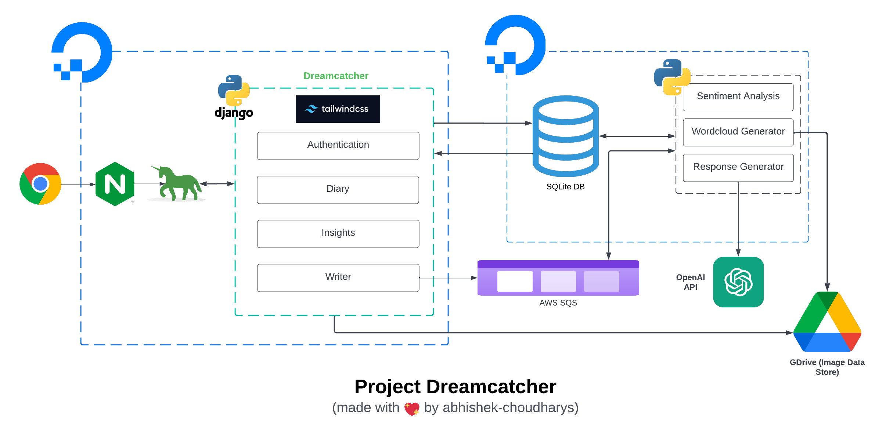

# Project Dreamcatcher:
Discover an innovative AI-powered journaling companion designed to transform the solitary act of journaling into an engaging and interactive experience. Our AI journaling app leverages cutting-edge generative models to elevate your journaling journey.

Our intelligent agent delves deep into your writings, offering insightful feedback, helpful suggestions, and even a touch of humor based on your entries. It's not just a journal; it's a conversation with your thoughts.

But that's not all. The app effortlessly tracks your emotional journey through your writing, providing valuable insights and reflections that resonate with your feelings, making each entry a profound exploration of your inner world.

<i>"Experience journaling like never before with an AI-powered companion."</i>

## Tech stack:

| Type     | Tools |
| -------- | ------- |
| <b>Development</b>  | Django, SQLite, AWS SQS, TailwindCSS     |
| <b>Hosting and deployment</b> | Nginx, Gunicorn, DigitalOcean Droplet, GDrive(Data Store)     |
| <b>Domain</b>    | https://www.dreamcatcher.buzz (currently inactive)    |

## Architecture

Detailed Architectural Diagram

## Snapshots and videos:

Coming Soon

## Source Code:
The code for dreamcatcher can be found at this link once it is made public:
https://github.com/abhishek-choudharys/Dreamcatcher